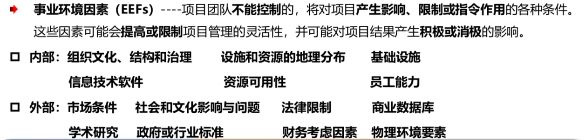
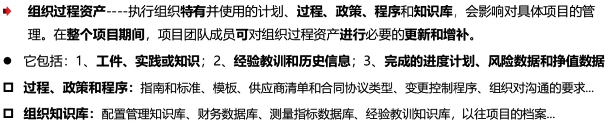

<!--
 * @Author: your name
 * @Date: 2020-09-01 17:50:45
 * @LastEditTime: 2020-09-04 17:37:55
 * @LastEditors: Please set LastEditors
 * @Description: In User Settings Edit
 * @FilePath: \PMP\知识点\Chapter1-3.md
-->

# Chapter1-3

## keys

### 工作绩效 VS 工作信息 VS 工作报告

体检数据 → BMI → 健身建议

- 工作绩效：最原始数据；
- 工作信息：初步处理的数据；
- 工作报告：汇总数据得出结论；

### 项目 VS 运营 VS 运维

- 项目：独特性、临时性；
- 运营：重复性，关注产品的持续生产，或输入零部件到输出产品的过程；经营性质的工作；
- 运维：技术性，关注平台 bug，持续性的维护;

### 组织结构类型

- 职能型：权利 很小/无，晋升明确 上部协调
- 弱矩阵型：权利 小，下部协调
- 平衡矩阵型：权利 小到中，多头管理 活多
- 强矩阵型：权利 中到大 全职经理，出现了项目经理的经理
- 项目型：权利 大 全职经理， 无安全感

紧密矩阵是指集中办公，不是一种组织结构

### 项目经理的权利

- 专家权利
- 奖励权利
- 合法权利
- 参照权利
- 惩罚权利

### 经理的领导风格

- 放任型：让员工自己设置目标，无为而治，容易有问题
- 交易型：达到目标后进行奖励
- 服务型：关心员工发展
- 变革型：提倡创新
- 魅力型：富有激情
- 交互型：交易、变革和魅力总和

### 项目 VS 项目集 VS 项目组合

- 项目：以正确的方式开展项目;
- 项目集：以正确的方式开展项目，项目间存在依赖关系，协调管理；
- 项目组合：开展正确的项目，强调项目的优先级顺序，有效利用资源，以实现最后的战略目标；

### 项目生命周期 VS 项目阶段 VS 通用生命周期 VS 项目开发生命周期 VS 项目管理过程组 VS 项目管理过程 VS 产品生命周期

- 项目生命周期：项目从开始到结束的阶段；
- 项目阶段：有逻辑关系的活动集合，以可交付成果作为结束；项目生命周期可以划分为不同阶段；
- 通用生命周期：所有的项目都可以概括为以下生命周期，开始项目、组织与准备、执行项目工作、结束项目；
- 项目开发生命周期：项目生命周期中与产品开发相关的阶段，可能有多个；项目开发生命周期类型：预测型、迭代型、增量型、适应型(敏捷型)、混合型；
- 项目管理过程组：五大过程组，启动、规划与制定、执行、监控、收尾，项目的每个阶段都可能执行每个过程组；
- 项目管理过程：49 个项目管理过程，输入、技术和工具、输出，ITTO；
- 产品生命周期：一个产品从概念到衰退的过程；

### 项目开发生命周期类型

- 预测型：有行业基础，结果及过程可预知，一次性交付；
- 迭代型：从模糊到清晰，每次更新全部模块；
- 增量型：从部分到整体，逐个模块完成；
- 敏捷型：又叫适应型，包括迭代和增量型；小步快走，根据优先顺序，每次更新最重要的部分，适应于创新型可以快速适应变化；
- 混合型：大瀑布小敏捷，整个项目是预测型，其中某个阶段是适应型；

### 事业环境因素 VS 组织过程资产

- 事业环境因素:不可控，需遵守
  
- 组织过程资产:可裁剪，多积累
  
