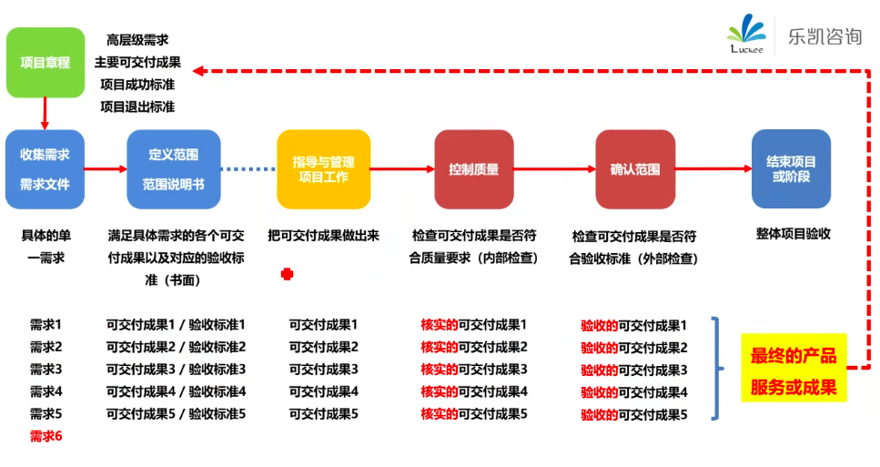
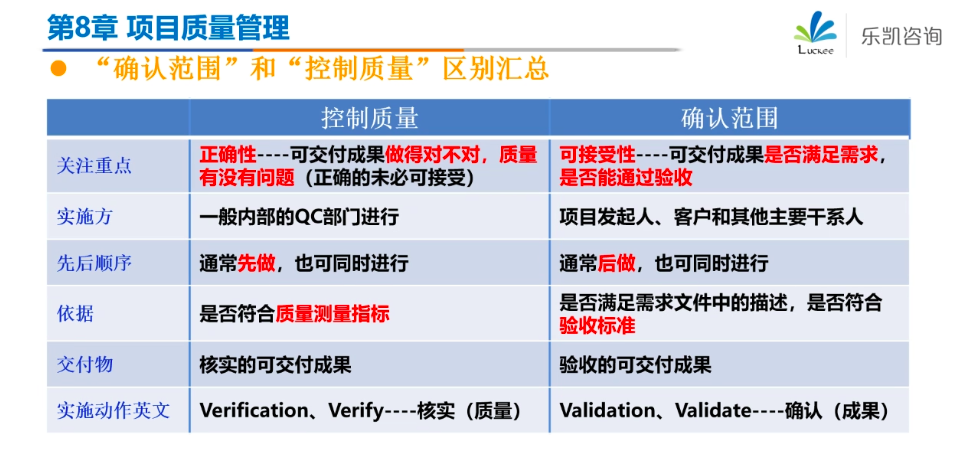

<!--
 * @Author: your name
 * @Date: 2020-09-22 09:19:41
 * @LastEditTime: 2020-10-15 11:27:13
 * @LastEditors: Please set LastEditors
 * @Description: In User Settings Edit
 * @FilePath: \PMP\知识点\Chapter6\index.md
-->

# Chapter8

## keys

## 项目质量管理

### 规划质量管理

定标准

#### 质量管理水平

- 客户发现
- 控制质量(QC,检测和纠正缺陷,评估成本和内部失败成本)
- 质量保证||管理质量(QA，检查并纠正过程)
- 规划和设计(QP)
- 产品质量文化

#### 工具与技术

##### 数据分析

- 成本效益分析
- 质量成本
  - 预防成本：预防、培训(项目用来规避失败，一致成本)
  - 评估成本：评估、审计、测试(项目用来规避失败，一致成本)
  - 失败成本：可交付成果与要求不符，功能缺陷，又叫缺陷成本(项目已失败，非一致成本)
    - 内部(公司内部团队，返工、报废)
    - 外部(客户，保修、失去业务)

### 管理质量

管过程

#### 工具与技术

##### 数据表现

- 亲和图：分组、分类
- 流程图
- 直方图：展示数据
- 散点图：确定因素之间的关系
- 因果图：鱼骨图，发现根本原因
- 帕累托图：发现主要原因

##### 审计

##### 面向 X 的设计

### 控制质量

查结果

#### 工具与技术

##### 数据收集

- 核对单(checklist,打钩)
- 核查表(check sheet,可以结合帕累托图使用，又叫计数表)
- 统计抽样：看频率
- 属性抽样：是否合格
- 变量抽样：合格的程度
- 问卷调查

##### 数据表现

- 控制图：过程是否稳定，看是否具有可预测性绩效

##### 规格限 VS 控制限

#### 输出

- 质量控制测量结果
- 核实的可交付成果

#### 控制质量 VS 确认范围

##### 控制质量与确认范围的关系

##### 控制质量与确认范围的区别

